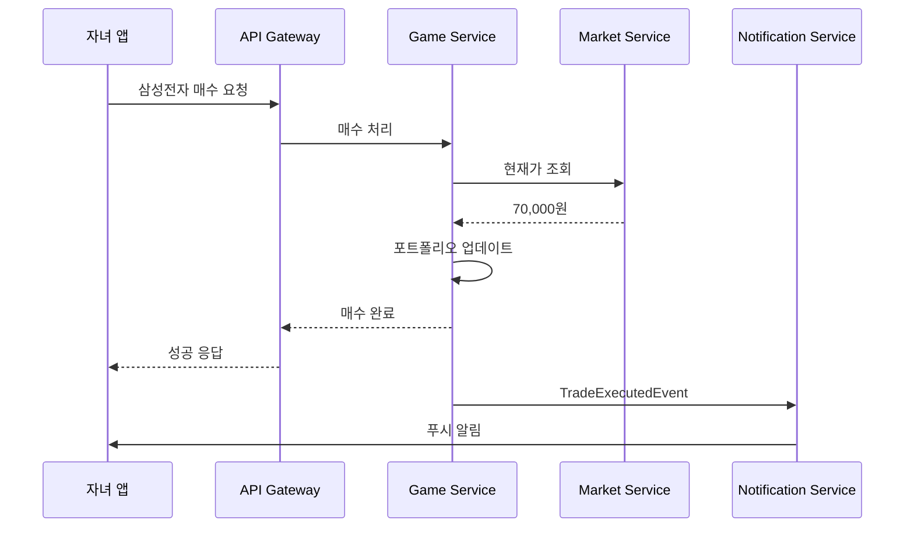
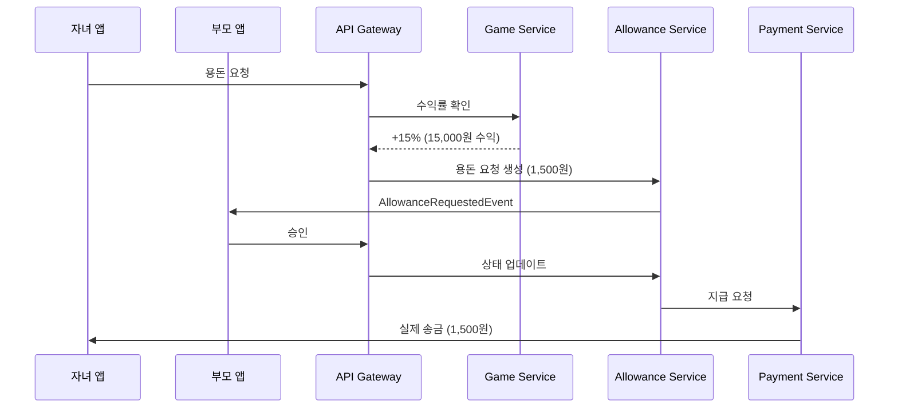
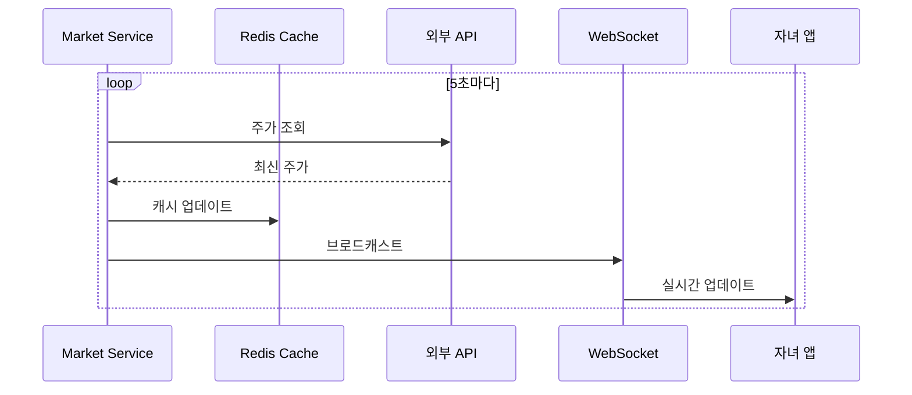

## 📋 목차

1. [시스템 아키텍처 개요](#%EC%8B%9C%EC%8A%A4%ED%85%9C-%EC%95%84%ED%82%A4%ED%85%8D%EC%B2%98-%EA%B0%9C%EC%9A%94)
2. [도메인 분석 (DDD)](#%EB%8F%84%EB%A9%94%EC%9D%B8-%EB%B6%84%EC%84%9D-ddd)
3. [마이크로서비스 설계 (MSA)](#%EB%A7%88%EC%9D%B4%ED%81%AC%EB%A1%9C%EC%84%9C%EB%B9%84%EC%8A%A4-%EC%84%A4%EA%B3%84-msa)
4. [기술 스택](#%EA%B8%B0%EC%88%A0-%EC%8A%A4%ED%83%9D)
5. [인프라 구조](#%EC%9D%B8%ED%94%84%EB%9D%BC-%EA%B5%AC%EC%A1%B0)
6. [보안 설계](#%EB%B3%B4%EC%95%88-%EC%84%A4%EA%B3%84)
7. [데이터 플로우](#%EB%8D%B0%EC%9D%B4%ED%84%B0-%ED%94%8C%EB%A1%9C%EC%9A%B0)

---

## 🎯 시스템 아키텍처 개요

### 전체 구조도

```
┌─────────────────────────────────────────────────────────────┐
│                     API Gateway (Kong/AWS API Gateway)       │
│                  (인증, 라우팅, Rate Limiting)                │
└─────────────────────────────────────────────────────────────┘
                              │
        ┌─────────────────────┼─────────────────────┐
        │                     │                     │
┌───────▼────────┐   ┌───────▼────────┐   ┌───────▼────────┐
│  자녀 앱 (React Native)  부모 앱 (React Native)  관리자 웹    │
└────────────────┘   └────────────────┘   └────────────────┘
```

---

## 🎨 도메인 분석 (DDD)

### 1. 바운디드 컨텍스트 식별

#### **Core Domain (핵심 도메인)**

```
1️⃣ 투자 게임 도메인 (Investment Game Context)
   - 게임머니 관리
   - 포트폴리오 구성
   - 매매 시뮬레이션
   - 수익률 계산

2️⃣ 용돈 관리 도메인 (Allowance Context)
   - 용돈 요청/승인
   - 환산 로직 (게임머니 → 실제 용돈)
   - 지급 내역 관리
```

#### **Supporting Domain (지원 도메인)**

```
3️⃣ 사용자 관리 도메인 (User Management Context)
   - 회원가입/로그인
   - 가족 관계 설정 (부모-자녀)
   - 권한 관리

4️⃣ 시장 데이터 도메인 (Market Data Context)
   - 실시간 주가 조회
   - 종목 정보 관리
   - 뉴스/공시 수집
```

#### **Generic Domain (일반 도메인)**

```
5️⃣ 알림 도메인 (Notification Context)
   - 푸시 알림
   - 이메일/SMS 발송

6️⃣ 결제 도메인 (Payment Context)
   - 프리미엄 구독
   - 실제 용돈 지급 연동
```

### 2. 도메인 모델 설계

#### 투자 게임 도메인

typescript

```typescript
// Aggregate Root
class GamePortfolio {
  portfolioId: PortfolioId
  userId: UserId
  gameBalance: Money
  holdings: Holding[]
  
  // Domain Logic
  buyStock(stock: Stock, quantity: number): void
  sellStock(stockId: StockId, quantity: number): void
  calculateReturns(): ReturnRate
  requestAllowance(): AllowanceRequest
}

// Value Object
class Money {
  amount: number
  currency: 'GAME' | 'KRW'
}

// Entity
class Holding {
  holdingId: HoldingId
  stock: Stock
  quantity: number
  avgPurchasePrice: Money
  currentValue: Money
}
```

#### 용돈 관리 도메인

typescript

```typescript
// Aggregate Root
class AllowanceRequest {
  requestId: RequestId
  childId: UserId
  parentId: UserId
  gameProfit: Money
  convertedAmount: Money  // 게임머니 / 10
  status: 'PENDING' | 'APPROVED' | 'REJECTED'
  
  // Domain Logic
  approve(parentId: UserId): void
  reject(parentId: UserId, reason: string): void
  calculateConversion(rate: number): Money
}

// Domain Service
class AllowanceCalculationService {
  calculateAllowance(portfolio: GamePortfolio): Money {
    const profit = portfolio.calculateReturns()
    if (profit.amount <= 0) return Money.ZERO
    return new Money(profit.amount / 10, 'KRW')
  }
}
```

---

## 🔧 마이크로서비스 설계 (MSA)

### 서비스 목록 및 책임

#### 1️⃣ **User Service** (사용자 관리)

yaml

```yaml
포트: 8001
데이터베이스: PostgreSQL
책임:
  - 회원가입/로그인 (JWT 토큰 발급)
  - 가족 관계 설정
  - 프로필 관리
API:
  POST /api/users/register
  POST /api/users/login
  POST /api/users/family/link
  GET  /api/users/{userId}/profile
```

#### 2️⃣ **Investment Game Service** (투자 게임 핵심)

yaml

```yaml
포트: 8002
데이터베이스: PostgreSQL + Redis (캐싱)
책임:
  - 게임머니 관리
  - 매매 시뮬레이션
  - 포트폴리오 계산
  - 수익률 분석
API:
  GET  /api/game/portfolio/{userId}
  POST /api/game/trade/buy
  POST /api/game/trade/sell
  GET  /api/game/performance/{userId}
```

#### 3️⃣ **Market Data Service** (시장 데이터)

yaml

```yaml
포트: 8003
데이터베이스: TimescaleDB (시계열 DB)
외부 연동: Alpha Vantage, Yahoo Finance API
책임:
  - 실시간 주가 조회
  - 과거 데이터 제공
  - 종목 검색
API:
  GET  /api/market/stocks/{symbol}/price
  GET  /api/market/stocks/{symbol}/history
  GET  /api/market/search?keyword=삼성
```

#### 4️⃣ **Allowance Service** (용돈 관리)

yaml

```yaml
포트: 8004
데이터베이스: PostgreSQL
책임:
  - 용돈 요청 생성
  - 부모 승인/거절
  - 지급 내역 관리
  - 환산 로직
API:
  POST /api/allowance/request
  PUT  /api/allowance/{requestId}/approve
  GET  /api/allowance/history/{userId}
```

#### 5️⃣ **Notification Service** (알림)

yaml

```yaml
포트: 8005
메시지 큐: RabbitMQ / AWS SQS
책임:
  - 푸시 알림 (FCM)
  - 이메일 발송
  - 이벤트 기반 알림
API:
  POST /api/notifications/push
  POST /api/notifications/email
```

#### 6️⃣ **Payment Service** (결제)

yaml

```yaml
포트: 8006
외부 연동: 토스페이먼츠, 카카오페이
책임:
  - 프리미엄 구독 결제
  - 실제 용돈 지급 (계좌 이체)
API:
  POST /api/payment/subscribe
  POST /api/payment/transfer
```

### 서비스 간 통신

#### 동기 통신 (REST/gRPC)

```
User Service → Investment Game Service (사용자 검증)
Investment Game Service → Market Data Service (주가 조회)
Allowance Service → Investment Game Service (수익률 확인)
```

#### 비동기 통신 (Event-Driven)

```
Investment Game Service --[TradeExecutedEvent]--> Notification Service
Allowance Service --[AllowanceApprovedEvent]--> Payment Service
Allowance Service --[AllowanceRequestedEvent]--> Notification Service
```

---

## 💻 기술 스택

### Backend

yaml

```yaml
언어: 
  - Kotlin + Spring Boot (User, Allowance)
  - Node.js + NestJS (Investment Game, Market Data)
  
프레임워크:
  - Spring Cloud (서비스 디스커버리)
  - Netflix Eureka (서비스 레지스트리)
  
통신:
  - REST API (기본)
  - gRPC (서비스 간 고성능 통신)
  - GraphQL (클라이언트 최적화)
```

### Database

yaml

```yaml
관계형: PostgreSQL (User, Allowance, Investment)
시계열: TimescaleDB (Market Data 과거 데이터)
캐시: Redis (실시간 주가, 세션)
검색: Elasticsearch (종목 검색)
```

### 메시지 큐

yaml

```yaml
RabbitMQ / AWS SQS (이벤트 버스)
Kafka (대용량 로그, 분석)
```

### Frontend

yaml

```yaml
모바일: React Native (iOS/Android)
웹: Next.js + TypeScript
상태관리: Zustand / Redux Toolkit
```

### 인프라

yaml

```yaml
컨테이너: Docker + Kubernetes (EKS)
CI/CD: GitHub Actions + ArgoCD
모니터링: Prometheus + Grafana
로깅: ELK Stack (Elasticsearch, Logstash, Kibana)
APM: Datadog / New Relic
```

---

## ☁️ 인프라 구조

### AWS 아키텍처

```
┌─────────────────────────────────────────────────────────┐
│                    Route 53 (DNS)                        │
└─────────────────────────────────────────────────────────┘
                          │
┌─────────────────────────▼─────────────────────────────┐
│              CloudFront (CDN) + WAF                    │
└────────────────────────────────────────────────────────┘
                          │
┌─────────────────────────▼─────────────────────────────┐
│         Application Load Balancer (ALB)                │
└────────────────────────────────────────────────────────┘
                          │
        ┌─────────────────┴──────────────────┐
        │                                    │
┌───────▼────────┐                  ┌────────▼───────┐
│   EKS Cluster   │                  │   API Gateway   │
│   (Kubernetes)  │                  │   (REST/GraphQL)│
│                 │                  └─────────────────┘
│ ┌─────────────┐ │
│ │ User Svc    │ │
│ │ Game Svc    │ │
│ │ Market Svc  │ │
│ │ ...         │ │
│ └─────────────┘ │
└─────────────────┘
        │
┌───────▼────────────────────────────────────┐
│  RDS (PostgreSQL Multi-AZ)                 │
│  ElastiCache (Redis)                       │
│  S3 (정적 파일, 로그)                        │
└────────────────────────────────────────────┘
```

### 개발/운영 환경 분리

yaml

```yaml
환경:
  - dev: 개발 환경 (단일 클러스터)
  - staging: 스테이징 (프로덕션 미러링)
  - prod: 운영 환경 (HA 구성)

브랜치 전략:
  - feature/* → dev
  - develop → staging
  - main → prod
```

---

## 🔒 보안 설계

### 인증/인가

yaml

```yaml
인증:
  - JWT 토큰 (Access Token: 15분, Refresh Token: 7일)
  - OAuth 2.0 (소셜 로그인)
  
인가:
  - RBAC (Role-Based Access Control)
    - CHILD: 자녀 권한
    - PARENT: 부모 권한
    - ADMIN: 관리자 권한
```

### 데이터 보호

yaml

```yaml
전송 중: TLS 1.3 (HTTPS)
저장 시: AES-256 암호화 (민감 정보)
개인정보: 
  - 마스킹 처리 (로그)
  - 최소 수집 원칙
  - 정기 삭제 (3년)
```

### API 보안

yaml

```yaml
Rate Limiting: 
  - 일반: 100 req/min
  - 거래: 10 req/min
  
CORS: 허용 도메인 화이트리스트
CSRF: Token 기반 방어
Input Validation: 모든 입력 검증
```

---

## 🔄 데이터 플로우

### 1. 투자 게임 플로우

mermaid



### 2. 용돈 요청 플로우

mermaid



### 3. 실시간 주가 업데이트

mermaid



---

## 📊 성능 최적화

### 캐싱 전략

yaml

```yaml
레벨 1 (CDN):
  - 정적 파일 (이미지, JS, CSS)
  - TTL: 1일
  
레벨 2 (Redis):
  - 실시간 주가: 5초
  - 포트폴리오: 30초
  - 사용자 세션: 15분
  
레벨 3 (Application):
  - 종목 정보: 1시간
  - 뉴스: 10분
```

### 데이터베이스 최적화

sql

```sql
-- 인덱스 설계
CREATE INDEX idx_portfolio_user ON portfolios(user_id);
CREATE INDEX idx_holdings_stock ON holdings(stock_id, user_id);
CREATE INDEX idx_trades_timestamp ON trades(created_at) WHERE status = 'COMPLETED';

-- 파티셔닝 (시계열 데이터)
CREATE TABLE stock_prices (
    symbol VARCHAR(10),
    price DECIMAL(10,2),
    timestamp TIMESTAMPTZ
) PARTITION BY RANGE (timestamp);
```

---

## 🚀 배포 전략

### 무중단 배포 (Blue-Green)

yaml

```yaml
1. Blue 환경 (현재 운영)
2. Green 환경에 신규 버전 배포
3. Health Check 통과 확인
4. 트래픽을 Green으로 전환
5. Blue 환경 대기 (롤백용)
```

### 카나리 배포

yaml

```yaml
1. 신규 버전 5% 트래픽으로 배포
2. 에러율 모니터링 (1시간)
3. 정상 시 50% → 100% 점진 확대
4. 이상 시 즉시 롤백
```

---

## 📈 모니터링 및 알림

### 핵심 지표

yaml

```yaml
Golden Signals:
  - Latency: P50, P95, P99 (< 500ms)
  - Traffic: RPS (초당 요청)
  - Errors: 5xx 비율 (< 0.1%)
  - Saturation: CPU/메모리 (< 70%)

비즈니스 지표:
  - DAU/MAU
  - 평균 게임 머니 수익률
  - 용돈 요청 승인율
  - 프리미엄 전환율
```

### 알림 설정

yaml

```yaml
Critical (즉시 대응):
  - 서비스 다운
  - DB 장애
  - 결제 실패율 > 5%
  
Warning (30분 내 확인):
  - 응답 시간 > 2초
  - 에러율 > 1%
  - 디스크 사용량 > 80%
```